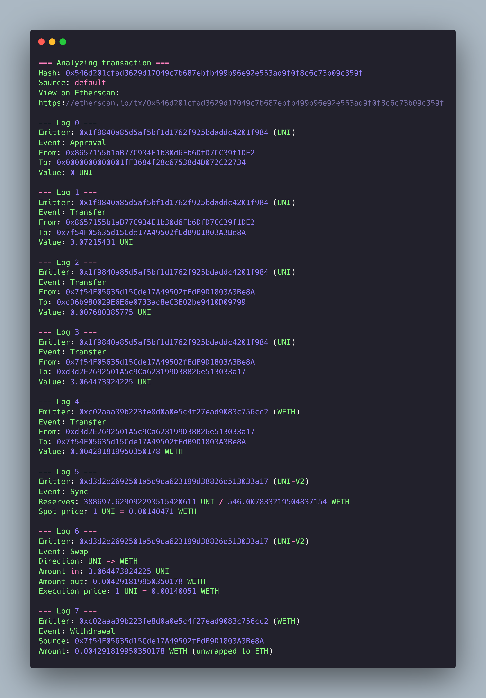

# evm-log-explorer

A CLI tool that decodes Ethereum transaction logs into a readable token flow - with symbols, human-readable amounts, and AMM math.



## About

I started this project while diving into on-chain forensics. Reading transactions on Etherscan only gets you so far - the UI shows you the surface, not the full structure of what happened. To go deeper, you need to read raw logs, decode them with the right ABIs, and understand the math behind events like Uniswap swaps. Doing that by hand is tedious. So I built a tool that does it for me.

`evm-log-explorer` takes a transaction hash, fetches the receipt, and decodes every log against a set of ABIs (ERC-20, Uniswap V2 Pool, WETH). It resolves token symbols and decimals on the fly, formats raw `bigint` amounts into human-readable numbers, and writes out exactly what each event means - who sent what, what swapped for what, and what the pool's state looks like after.

It also goes beyond what most decoders show. For Uniswap V2 swaps, it computes both the spot price (from `Sync` reserves) and the execution price (from the `Swap` event), so you can see the actual slippage in any trade. The codebase is intentionally modular and well-commented - if you're learning how to work with Ethereum logs, the source is meant to be read as well as run.

## Features

- **Multi-protocol decoder** - supports ERC-20, Uniswap V2 (Sync, Swap), and WETH (Deposit, Withdrawal) events out of the box.
- **Token-aware output** - automatically resolves token symbols and decimals on the fly, no hardcoded lists.
- **Human-readable amounts** - converts raw `bigint` values into formatted numbers using each token's actual decimals.
- **Slippage analysis** - computes spot price (from `Sync` reserves) and execution price (from `Swap` event) for any V2 trade.
- **RPC-efficient** - caches token info and pool metadata to avoid redundant `readContract` calls.
- **Modular architecture** - ABIs are isolated per-protocol. Adding support for a new event type is one ABI file and one line of code.

## Quickstart

### Prerequisites

- Node.js 18 or higher
- An Ethereum RPC endpoint (free options: [Alchemy](https://www.alchemy.com/), [Infura](https://www.infura.io/))

### Installation

```bash
git clone https://github.com/Frodrinos/evm-log-explorer.git
cd evm-log-explorer
npm install
```

### Configuration

Copy the example environment file and add your RPC URL:

```bash
cp .env.example .env
```

Edit `.env`:

```
RPC_URL=https://eth-mainnet.g.alchemy.com/v2/YOUR_API_KEY
```

### Run

Decode a transaction:

```bash
node main.js 0x546d201cfad3629d17049c7b687ebfb499b96e92e553ad9f0f8c6c73b09c359f
```

Or run with the default test transaction:

```bash
node main.js
```

## Examples

### Simple ERC-20 transfer

```bash
node main.js 0x50fe15faec09927bf63e3567ee09b36ccb8d4fcb755d66cbbd181d8e55067024
```

A clean USDC transfer between two addresses. The decoder shows the sender, recipient, and amount with the correct symbol and decimals - turning a single raw `Transfer` log into a one-line summary.

### Uniswap V2 swap

```bash
node main.js 0x546d201cfad3629d17049c7b687ebfb499b96e92e553ad9f0f8c6c73b09c359f
```

A UNI → ETH swap routed through Universal Router. Across 8 logs, the decoder reconstructs:

- Token transfers between user, router, fee receiver, and the UNI/WETH pool
- Pool reserves after the swap (`Sync` event) with computed spot price
- Direction, input and output amounts, and execution price (`Swap` event)
- WETH unwrap to native ETH (`Withdrawal` event)

The difference between spot price and execution price gives you the actual slippage - directly from on-chain data, no external pricing API needed.

## Project structure

```
evm-log-explorer/
├── main.js # Entry point - handles CLI args, fetches receipt, formats output
├── src/
│ ├── decoder.js # Core decoding logic - log → structured result
│ └── abis/
│ ├── uniswapV2.js # Uniswap V2 Pool events (Sync, Swap) and mini ABI for token0/token1
│ └── weth.js # WETH wrapper events (Deposit, Withdrawal)
├── .env.example # Template for environment variables
├── package.json
└── README.md
```

The decoder is a pure function - it takes a log and a viem client, returns a structured result. The main file handles everything else: CLI parsing, fetching the receipt, deciding how to display each event type. Caching for token info and pool metadata is internal to the decoder module.

## Roadmap

The current decoder covers the most common event types in DeFi, but there's plenty of room to grow:

- **ERC-721 / NFT support** - currently fails on NFT transfers because they have a different number of indexed parameters than ERC-20.
- **Uniswap V3 events** - `Mint`, `Burn`, `Swap`, and `Collect` use different signatures and concentrated liquidity logic.
- **Multi-hop swap analysis** - recognize and reconstruct full chains when a transaction routes through multiple pools.
- **Lending protocol support** - Aave, Compound borrow/repay/liquidation events.
- **Multi-chain support** - same ABIs work on L2s (Polygon, Arbitrum, Base, Optimism), only the RPC URL changes.
- **Web frontend** - a browser version so users can paste a hash without running anything locally.

If you want any of these, open an issue or contribute a PR.

## Tech stack

- [**viem**](https://viem.sh/) - Ethereum library for RPC calls, ABI decoding, and unit conversions.
- **Node.js** - runtime, with native ES modules and top-level await.
- **dotenv** - environment variable management.

## License

MIT
